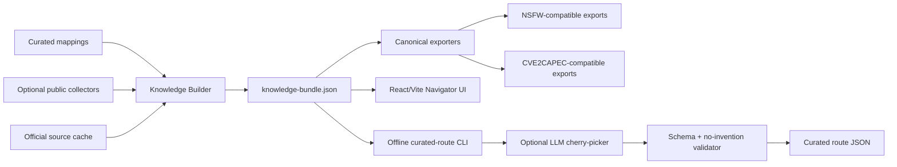

# Attack2Defend

> **Full traceability. Curated decision.**

**Attack2Defend** is a static-first cyber defense navigator that maps vulnerabilities and adversary techniques into defensive actions. It preserves the full traceability chain from `CVE → CWE → CAPEC → ATT&CK → D3FEND`, then turns that graph into a curated, auditable, SOC-ready decision path with evidence, owners, gaps and closure criteria.

It is designed for security teams that need to answer one question fast:

> **“Given this CVE, weakness, technique or defense concept, what should we validate, detect, prove and close?”**

---

## Key Features

| Capability | What it does |
|---|---|
| **Deterministic knowledge graph** | Builds a local `knowledge-bundle.json` from curated mappings and optional public-source collectors. The browser consumes only this local bundle. |
| **End-to-end threat route** | Resolves `CVE → CWE → CAPEC → ATT&CK → D3FEND` with full traceability counts and stage-aware route selection. |
| **Defense readiness map** | Bridges technical exposure into `Control → Detection → Evidence → Gap → Action`, including owner-oriented operational guidance. |
| **Product Trust Layer** | Adds evidence badges, source inspection, detection disclaimers, potential gap cards and closure criteria directly in the UI. |
| **Validator-gated AI cherry-picking** | Supports optional offline/build-time Gemini, OpenAI or Anthropic route curation. LLM output is candidate-only; schema and no-invention validators decide. |

---

## Architecture

Attack2Defend is intentionally **static-first**. The UI does not call NVD, MITRE, CISA, LLM providers or any public API at runtime.



### Design Decisions

| Decision | Rationale |
|---|---|
| **Static browser runtime** | The UI is fast, portable and auditable. It only reads `/data/knowledge-bundle.json`. |
| **Builder-time enrichment** | Public data ingestion happens before runtime, where it can be cached, validated and reviewed. |
| **Full graph + curated route** | Analysts keep complete traceability, while decision-makers see a defensible route that is not a graph dump. |
| **Validator wins** | AI can rank/select candidates, but it cannot invent IDs, relationships, impact, affected assets or environment coverage. |
| **No coverage claims** | The tool suggests what to validate. It does not claim your environment is affected, protected or monitored unless you provide that evidence. |

---

## Prerequisites

| Requirement | Version / Notes |
|---|---|
| **Python** | `3.11+` |
| **Node.js** | `20+` recommended for the Vite UI |
| **npm** | Installed with Node.js |
| **make** | Used for build/test shortcuts |
| **Git** | Required to clone and version the repository |
| **Optional API keys** | NVD/Gemini/OpenAI/Anthropic only if you explicitly enable enrichment or offline LLM curation |

---

## Quick Start

### Run the full local product flow

```bash
git clone https://github.com/vPabloA/attack2defend.git
cd attack2defend
python3.11 -m venv .venv
source .venv/bin/activate
pip install -e ".[dev]"
make bootstrap-local-full
make ui
```

Open the Vite URL, usually:

```text
http://localhost:5173
```

### Validate before trusting the build

```bash
make test
```

### Generate a curated route from the CLI

```bash
python scripts/intelligence/curate_route.py \
  --bundle data/knowledge-bundle.json \
  --input CVE-2024-37079 \
  --pretty
```

### Run optional offline LLM cherry-picking

```bash
A2D_CHERRY_PICKER_MODE=llm \
A2D_AI_PROVIDER=gemini \
GEMINI_API_KEY="<your-key>" \
python scripts/intelligence/curate_route.py \
  --bundle data/knowledge-bundle.json \
  --input CVE-2024-37079 \
  --llm \
  --pretty
```

If no provider key is available, the CLI falls back to the deterministic route.

---

## Use Cases

### 1. Vulnerability-to-defense triage

A SOC or vulnerability manager receives a new high-impact CVE and needs an operational path.

```bash
python scripts/intelligence/curate_route.py \
  --bundle data/knowledge-bundle.json \
  --input CVE-2021-44228 \
  --pretty
```

Expected result: a route from CVE to weaknesses, attack patterns, ATT&CK techniques, D3FEND concepts, suggested detections, evidence requirements, gaps and closure actions.

### 2. ATT&CK-driven defensive readiness

A threat hunter starts from an adversary technique and needs defensive validation points.

```bash
python scripts/intelligence/curate_route.py \
  --bundle data/knowledge-bundle.json \
  --input T1190 \
  --pretty
```

Expected result: public-facing application exploitation mapped into applicable weaknesses, attack patterns, defensive concepts, evidence requirements and owner actions.

### 3. Executive-ready CTEM evidence pack

A security lead needs to show what is known, what is suggested and what still requires validation.

```bash
make bootstrap-local-full
make ui
```

Use the UI to inspect the curated route, open evidence badges, review potential gaps and export the Product Trust Layer JSON.

---

## Environment Variables

### Core build and public-source enrichment

| Variable | Required | Default | Purpose |
|---|---:|---|---|
| `A2D_REFRESH_PUBLIC_SOURCES` | No | unset | Refresh public-source cache during local bootstrap. |
| `NVD_API_KEY` | No | unset | Optional NVD enrichment key. The product can run without it. |

### AI cherry-picker

| Variable | Required | Default | Purpose |
|---|---:|---|---|
| `A2D_CHERRY_PICKER_MODE` | No | `deterministic` | Use `deterministic` or `llm`. LLM requires explicit `--llm`. |
| `A2D_AI_PROVIDER` | No | `gemini` | One of `gemini`, `openai`, `anthropic`. |
| `A2D_GEMINI_MODEL` | No | `gemini-2.5-flash-lite` | Gemini model for offline curation. |
| `GEMINI_API_KEY` / `GOOGLE_API_KEY` | Only for Gemini LLM | unset | Gemini provider credential. |
| `A2D_OPENAI_MODEL` | No | `gpt-5-nano` | OpenAI model for offline curation. |
| `OPENAI_API_KEY` | Only for OpenAI LLM | unset | OpenAI provider credential. |
| `A2D_ANTHROPIC_MODEL` | No | `claude-3-5-haiku-latest` | Anthropic model for offline curation. |
| `ANTHROPIC_API_KEY` | Only for Anthropic LLM | unset | Anthropic provider credential. |
| `A2D_CHERRY_PICKER_TEMPERATURE` | No | `0` | Keeps output deterministic and validation-friendly. |
| `A2D_CHERRY_PICKER_MAX_OUTPUT_TOKENS` | No | `4000` | Max provider output tokens. |
| `A2D_CHERRY_PICKER_TIMEOUT_SECONDS` | No | `60` | Provider call timeout for offline curation. |
| `A2D_CHERRY_PICKER_REQUIRE_VALIDATION` | No | `true` | Must remain true for production use. |
| `A2D_CHERRY_PICKER_ALLOW_EXTERNAL_KNOWLEDGE` | No | `false` | Must remain false. Provider may only use the context pack. |
| `A2D_CHERRY_PICKER_RUNTIME_PUBLIC_API_CALLS` | No | `false` | Must remain false. Browser/runtime calls are not allowed. |

---

## Commands

| Command | Purpose |
|---|---|
| `make bootstrap-local-full` | Build the local knowledge bundle, apply mapping backbone, generate canonical exports and mirror data to the UI. |
| `make build-curated` | Build from curated sample routes. |
| `make build-public` | Build with public-source collectors. |
| `make build-backbone` | Apply local mapping backbone and curated defense mappings. |
| `make build-canonical` | Generate NSFW and CVE2CAPEC canonical exports from the bundle. |
| `make validate` | Validate bundle contract, mapping backbone, semantic routes and canonical exports. |
| `make test` | Run Python tests and Vite build. |
| `make ui` | Start the React/Vite dev server. |
| `make preprod` | Public-source pre-prod bootstrap with mapping backbone and canonical exports. |

---

## Validation Gates

Run all core checks:

```bash
make test
```

Validate the generated bundle directly:

```bash
python scripts/knowledge_builder/validate_bundle.py \
  data/knowledge-bundle.json \
  --require-mapping-backbone \
  --require-semantic-routes \
  --require-framework-chain \
  --require-cpe-index \
  --require-kev-index \
  --require-bidirectional-indexes \
  --require-source-confidence \
  --require-search-index \
  --min-mapping-files 1
```

Validate canonical export parity:

```bash
python scripts/canonical_exports/validate_canonical.py
```

---

## Repository Layout

```text
attack2defend/
├── app/navigator-ui/                 # React/Vite static UI
│   └── public/
│       ├── data/                     # mirrored knowledge-bundle.json
│       └── trust-layer.js            # Product Trust Layer UI enhancer
├── contracts/                        # mapping and bundle contracts
├── data/
│   ├── mappings/                     # mapping backbone and curated defense mappings
│   ├── raw/                          # public-source cache
│   ├── canonical/                    # NSFW + CVE2CAPEC compatible exports
│   ├── knowledge-bundle.json         # generated local static bundle
│   └── knowledge-bundle.last-good.json
├── schemas/                          # curated route and official context pack schemas
├── scripts/
│   ├── intelligence/                 # curated route CLI + optional LLM cherry-picker
│   ├── knowledge_builder/            # bundle builder and validators
│   ├── mapping_builder/              # mapping backbone applicator
│   └── canonical_exports/            # canonical export builder/validator
├── src/attack2defend/                # Python package
└── tests/                            # regression, schema and GA gates
```

---

## Production Rules

```text
Full graph is deterministic.
Curated route is validator-gated.
LLM output is candidate-only.
The UI is static-first.
No browser public API calls.
No source, no selection.
No evidence, no promotion.
Validator wins.
```

---

## Release

Current GA target:

```text
v1.0.0-ga
```

Recommended post-merge tag:

```bash
git checkout main
git pull origin main
git tag -a v1.0.0-ga -m "Attack2Defend GA: static-first defense navigator with trust layer and validator-gated AI curation"
git push origin v1.0.0-ga
```
