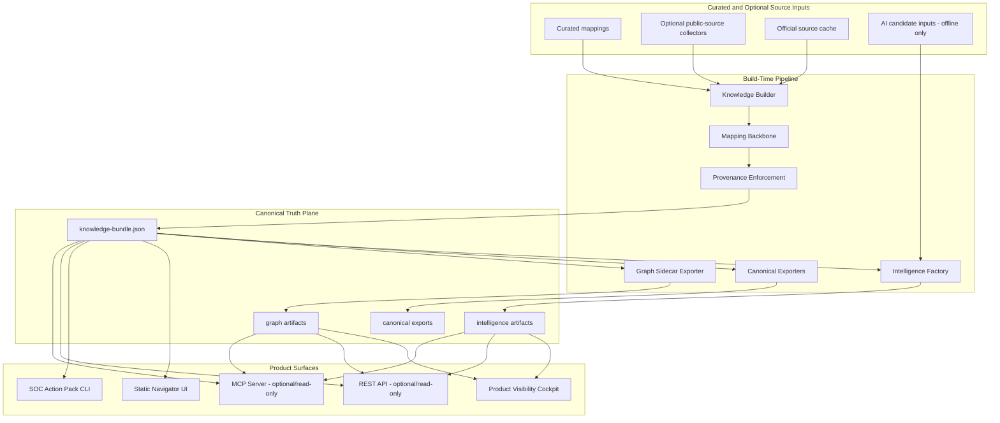
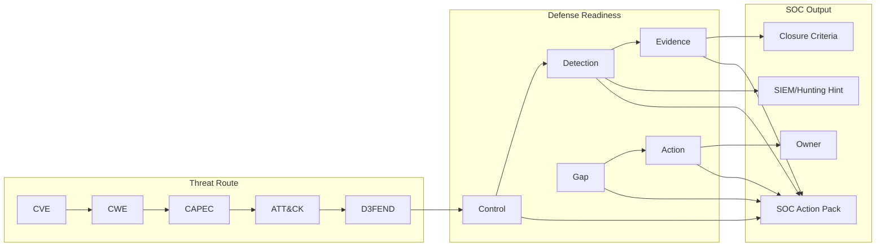
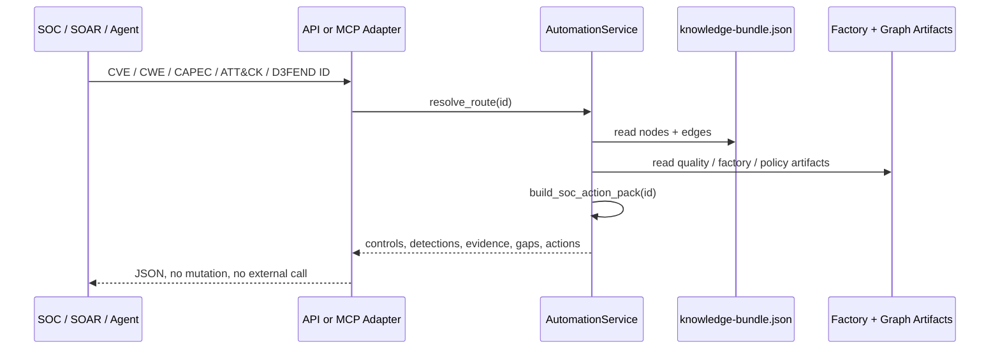
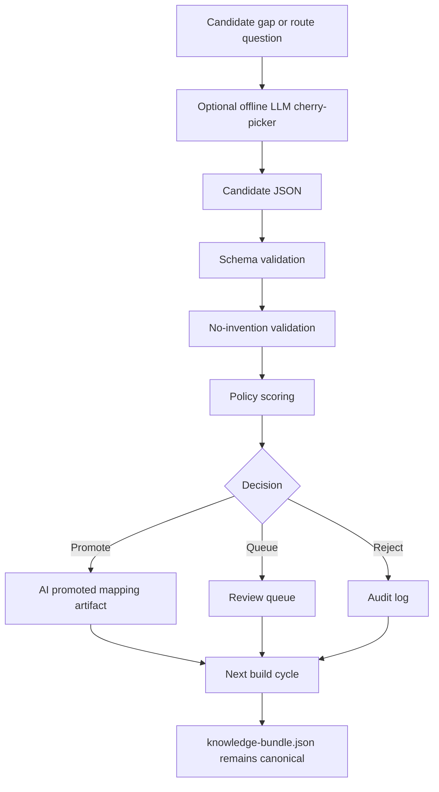
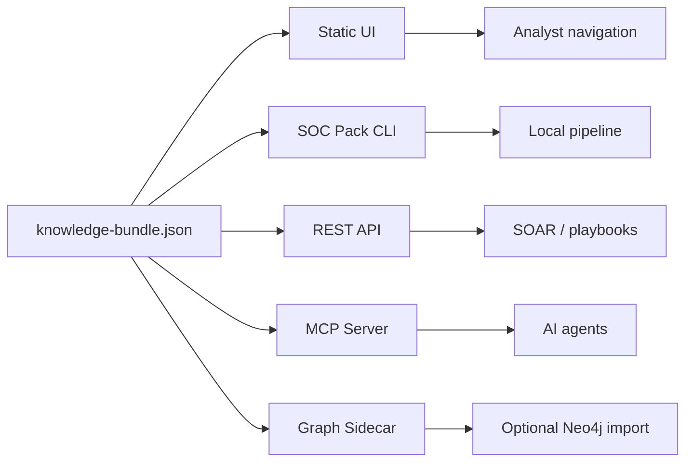

# Attack2Defend

> **From vulnerability to defensive action — deterministic, auditable, SOC-ready.**

**Attack2Defend** is a static-first cyber defense intelligence navigator and automation layer that maps vulnerabilities, weaknesses and adversary techniques into defensive routes, evidence requirements, coverage gaps and SOC actions.

It starts with the chain:

```text
CVE → CWE → CAPEC → ATT&CK → D3FEND
```

Then it turns that route into something a SOC can actually use:

```text
Control → Detection → Evidence → Gap → Action
```

Attack2Defend is built for teams that need to answer one operational question fast:

> **Given this CVE, weakness, attack pattern, ATT&CK technique or D3FEND concept — what should we validate, detect, prove and close?**

---

## Executive Summary

Attack2Defend is not just a mapping table and not just a graph viewer.

It is a deterministic, auditable defensive intelligence product with:

| Layer | Capability |
|---|---|
| **Static-first navigator** | Browser UI consumes only local `/data/knowledge-bundle.json`. No browser runtime calls to public APIs or LLM providers. |
| **Canonical knowledge bundle** | Generated local source of truth for CVE/CWE/CAPEC/ATT&CK/D3FEND/control/detection/evidence/gap/action routes. |
| **Provenance layer** | Preserves source references and validates edge provenance before trust or promotion. |
| **Intelligence Factory** | Candidate processing, scoring, policy decisions, review queues and audit artifacts. |
| **Product Visibility Layer** | Static cockpit and mirrored artifacts for product/readiness inspection. |
| **Graph Sidecar** | Optional graph export to CSV/Cypher/query pack with quality reporting. Neo4j is optional, never required. |
| **MCP/API Automation Layer** | Optional read-only REST API and MCP-style stdio server for agents, SOAR and local automation. |
| **SOC Action Pack** | D3FEND-to-SOC output: detections, evidence, gaps, actions, owners and deterministic top mitigations. |

---

## Why Attack2Defend Wins

| Reference capability | What it gives you | Attack2Defend GA adds |
|---|---|---|
| **CVE2CAPEC-style mapping** | CVE/weakness/attack-pattern route mapping | Full defensive route, provenance, SOC action packs, API/MCP consumption |
| **Capec2Neo4j-style graph** | Graph import/query capability | Optional graph sidecar over the full bundle, quality report and SOC query pack without making Neo4j runtime mandatory |
| **nsfw-style static navigation** | Fast static knowledge navigation | Static-first navigator plus trust layer, intelligence factory, graph sidecar and automation surfaces |
| **AIDEFEND-style automation** | Agent-friendly defense knowledge workflows | Local/offline MCP/API with D3FEND output rendered into SOC-operable evidence, gaps and actions |

The design principle is simple:

```text
The bundle is the source of truth.
Everything else is an adapter, renderer, export or validator.
```

---

## Product Architecture



---

## Defensive Knowledge Hierarchy

Attack2Defend separates threat route, defensive readiness and automation output.



---

## SOC Action Pack Workflow



If the route lacks evidence, detection, D3FEND mapping or provenance, the output is not inflated. It returns:

```json
{
  "status": "completed_with_gaps",
  "blocking": false,
  "timeout_waited_for_human": false
}
```

---

## AI Governance Model

AI is optional, offline/build-time and candidate-only. It does not control runtime, does not mutate the bundle and does not override validators.



Production rules:

```text
LLM output is candidate-only.
Validator wins.
No source, no selection.
No evidence, no confirmed coverage.
No runtime external API calls.
```

---

## Runtime Modes



| Mode | Command | Runtime dependencies | Mutates bundle? |
|---|---|---:|---:|
| Static UI | `make ui` | Node/Vite dev server | No |
| Full build | `make build-product` | Python + Node build tools | Yes, build artifacts only |
| SOC pack CLI | `make soc-pack INPUT=CVE-2021-44228` | Python stdlib + package | No |
| REST API | `make api-server` | Python stdlib HTTP server | No |
| MCP server | `make mcp-server` | Python stdlib stdio JSON-RPC style server | No |
| Graph sidecar | `make graph-sidecar` | Python stdlib | Derived artifacts only |
| GA gate | `make ga-check` | Test/build toolchain | No runtime mutation |

---

## Key Features

| Capability | What it does |
|---|---|
| **Deterministic knowledge graph** | Builds a local `knowledge-bundle.json` from curated mappings and optional public-source collectors. |
| **Threat route resolution** | Resolves `CVE → CWE → CAPEC → ATT&CK → D3FEND` with full traceability. |
| **Defense readiness route** | Bridges the route into `Control → Detection → Evidence → Gap → Action`. |
| **SOC Action Pack** | Generates SOC-operable JSON: what to detect, what evidence to collect, what gaps exist and what actions owners should take. |
| **Top deterministic mitigations** | Produces local top mitigation recommendations from D3FEND/control/detection/evidence/provenance coverage. |
| **Product Trust Layer** | Adds evidence, disclaimers, gap visibility and closure criteria to product outputs. |
| **Intelligence Factory** | Handles candidate validation, policy scoring, promotion/queue/rejection and audit artifacts. |
| **Graph Sidecar** | Exports nodes/edges, Cypher schema/import scripts, query pack and graph quality report. |
| **MCP/API Automation Layer** | Exposes read-only local automation for agents and SOAR without external runtime calls. |
| **Static-first UI** | Browser consumes local data only. No runtime public API or LLM calls. |

---

## Quick Start

```bash
git clone https://github.com/vPabloA/attack2defend.git
cd attack2defend
python3.11 -m venv .venv
source .venv/bin/activate
pip install -e ".[dev]"
make bootstrap-local-full
make ui
```

Open the Vite URL, usually:

```text
http://localhost:5173
```

Validate the product before trusting the output:

```bash
make ga-check
```

---

## GO-GA Commands

| Command | Purpose |
|---|---|
| `make bootstrap-local-full` | Build the full local product flow. |
| `make build-product` | Build bundle, mirror artifacts and graph sidecar. |
| `make validate-product` | Validate bundle, canonical exports, golden routes, graph sidecar and static-first behavior. |
| `make ga-check` | Full GO-GA gate: product validation, API/MCP validation, tests and UI build. |
| `make graph-sidecar` | Export graph CSV/Cypher/query pack and validate graph artifacts. |
| `make soc-pack INPUT=CVE-2021-44228` | Generate SOC Action Pack JSON for a CVE or technique. |
| `make api-server` | Run optional read-only REST API. |
| `make mcp-server` | Run optional read-only MCP-style stdio server. |
| `make validate-api` | Validate API automation contracts without starting the server. |
| `make validate-mcp` | Validate MCP tool registry and SOAR-safe outputs. |
| `make test` | Run Python tests and Vite build. |
| `make ui` | Start the React/Vite navigator UI. |

---

## SOC Action Pack

Generate:

```bash
make soc-pack INPUT=CVE-2021-44228
```

Output shape:

```json
{
  "input": "CVE-2021-44228",
  "status": "completed_with_gaps",
  "blocking": false,
  "timeout_waited_for_human": false,
  "soc_pack": {
    "executive_summary": "...",
    "defensive_objective": "...",
    "threat_chain": {
      "cve": [],
      "cwe": [],
      "capec": [],
      "attack": [],
      "d3fend": []
    },
    "defense_readiness": {
      "controls": [],
      "detections": [],
      "evidence_required": [],
      "gaps": [],
      "actions": []
    },
    "top_3_recommendations": [],
    "integration_hints": {
      "siem_queries": [],
      "soar_playbook_steps": [],
      "detection_candidates": []
    },
    "operational_metadata": {
      "owners": [],
      "kev": false,
      "cpe_affected": [],
      "severity": "",
      "closure_criteria": []
    }
  },
  "audit": {
    "source_of_truth": "knowledge-bundle.json",
    "external_calls": false,
    "source_refs": [],
    "generated_at": "..."
  }
}
```

Detection outputs are **candidates**, not production rules. They require environmental validation before conversion to Detection-as-Code.

---

## REST API

Run:

```bash
make api-server
```

Endpoints:

| Method | Endpoint | Purpose |
|---|---|---|
| `GET` | `/api/v1/health` | Service health. |
| `GET` | `/api/v1/metadata` | Bundle metadata and counts. |
| `GET` | `/api/v1/route/{id}` | Resolve one defensive route. |
| `POST` | `/api/v1/route/batch` | Resolve multiple routes for SOAR enrichment. |
| `GET` | `/api/v1/soc-pack/{id}` | Generate SOC Action Pack. |
| `GET` | `/api/v1/d3fend/{id}/soc-actions` | Explain D3FEND as SOC actions. |
| `GET` | `/api/v1/factory/status` | Intelligence Factory status artifact. |
| `GET` | `/api/v1/factory/candidates` | Candidate/audit query. |
| `GET` | `/api/v1/policy` | Promotion policy. |
| `GET` | `/api/v1/golden/evaluation` | Golden route evaluation. |
| `GET` | `/api/v1/graph/quality` | Graph quality report. |
| `GET` | `/api/v1/search?q=` | Local bundle search. |
| `GET` | `/api/v1/evidence-pack/{id}` | Evidence pack for route validation. |

Examples:

```bash
curl http://127.0.0.1:8000/api/v1/health
curl http://127.0.0.1:8000/api/v1/route/CVE-2021-44228
curl http://127.0.0.1:8000/api/v1/soc-pack/CVE-2021-44228
```

Batch:

```bash
curl -X POST http://127.0.0.1:8000/api/v1/route/batch \
  -H 'Content-Type: application/json' \
  -d '{"ids":["CVE-2021-44228","T1190"]}'
```

---

## MCP Server

Run:

```bash
make mcp-server
```

List tools:

```bash
python -m attack2defend.mcp.server --list-tools
```

Generate local client config snippet:

```bash
python scripts/mcp/install.py
```

Tools:

| Tool | Purpose |
|---|---|
| `defense_route` | Resolve a deterministic route for one ID. |
| `batch_defense_route` | Resolve multiple IDs for SOAR/agent workflows. |
| `export_soc_pack` | Generate SOC Action Pack. |
| `explain_d3fend_for_soc` | Convert D3FEND node into SOC-operable actions. |
| `get_top_mitigations` | Return deterministic top mitigation recommendations. |
| `intelligence_factory_status` | Read local factory report. |
| `candidate_query` | Query local candidate/audit records. |
| `golden_evaluation` | Read golden route evaluation. |
| `graph_explore` | Explore local graph adjacency without Neo4j runtime. |
| `policy_inspect` | Read active promotion policy. |
| `provenance_audit` | Audit source references and provenance gaps. |

MCP example request:

```json
{
  "jsonrpc": "2.0",
  "id": 1,
  "method": "tools/call",
  "params": {
    "name": "defense_route",
    "arguments": {
      "id": "CVE-2021-44228"
    }
  }
}
```

---

## Graph Sidecar

Run:

```bash
make graph-sidecar
```

Generated artifacts:

| Artifact | Purpose |
|---|---|
| `data/graph/nodes.csv` | Node import file. |
| `data/graph/edges.csv` | Edge import file with provenance fields. |
| `data/graph/schema.cypher` | Neo4j constraints/indexes. |
| `data/graph/import.cypher` | Optional Neo4j import script. |
| `data/graph/neo4j_queries.cypher` | Query pack for route/gap/coverage exploration. |
| `data/graph/graph-summary.json` | Export summary. |
| `data/graph/graph-quality-report.json` | Structural quality and gap report. |

Neo4j is optional. The runtime product does not require it.

---

## Intelligence Factory

The Intelligence Factory supports controlled candidate processing:

```text
candidate → validate → score → policy decision → promote | queue | reject | audit
```

It is intentionally non-blocking:

```text
No input().
No human wait loops.
No direct bundle mutation.
No automatic trust of LLM output.
```

Important artifacts include:

| Artifact | Purpose |
|---|---|
| `data/intelligence/intelligence-factory-report.json` | Factory status and run summary. |
| `data/intelligence/promotion_policy.json` | Active promotion policy. |
| `data/candidates/audit_log.jsonl` | Candidate processing audit trail. |
| `data/reports/golden-route-evaluation.json` | Golden route evaluation. |
| `data/mappings/ai_promoted/` | Validator-gated promoted mappings. |

---

## Product Visibility Layer

The static visibility cockpit exposes mirrored intelligence artifacts for inspection without requiring a backend.

Typical local path:

```text
/intelligence-factory.html
```

It consumes local mirrored artifacts only. It does not call providers or backend services at runtime.

---

## Validation Gates

Core validation:

```bash
make validate
```

Product validation:

```bash
make validate-product
```

GO-GA validation:

```bash
make ga-check
```

Direct validators:

```bash
make validate-api
make validate-mcp
make validate-graph
```

Static-first check:

```bash
bash scripts/validate_static_first.sh
```

---

## Environment Variables

### Public-source enrichment

| Variable | Required | Default | Purpose |
|---|---:|---|---|
| `A2D_REFRESH_PUBLIC_SOURCES` | No | unset | Refresh public-source cache during local bootstrap. |
| `NVD_API_KEY` | No | unset | Optional NVD enrichment key. Product can run without it. |

### Offline AI curation

| Variable | Required | Default | Purpose |
|---|---:|---|---|
| `A2D_CHERRY_PICKER_MODE` | No | `deterministic` | Use `deterministic` or `llm`. LLM requires explicit `--llm`. |
| `A2D_AI_PROVIDER` | No | `openai` | Offline/build-time provider. One of `openai`, `gemini`, `anthropic`. |
| `A2D_OPENAI_MODEL` | No | `gpt-5-nano` | OpenAI model for offline curation. |
| `OPENAI_API_KEY` | Only for OpenAI LLM | unset | Credential for offline AI curation. |
| `A2D_GEMINI_MODEL` | No | `gemini-2.5-flash-lite` | Gemini model for offline curation. |
| `GEMINI_API_KEY` / `GOOGLE_API_KEY` | Only for Gemini LLM | unset | Gemini provider credential. |
| `A2D_ANTHROPIC_MODEL` | No | `claude-3-5-haiku-latest` | Anthropic model for offline curation. |
| `ANTHROPIC_API_KEY` | Only for Anthropic LLM | unset | Anthropic provider credential. |
| `A2D_CHERRY_PICKER_TEMPERATURE` | No | `0` | Keeps output deterministic and validation-friendly. |
| `A2D_CHERRY_PICKER_MAX_OUTPUT_TOKENS` | No | `4000` | Max provider output tokens. |
| `A2D_CHERRY_PICKER_TIMEOUT_SECONDS` | No | `60` | Provider call timeout for offline curation. |
| `A2D_CHERRY_PICKER_REQUIRE_VALIDATION` | No | `true` | Must remain true for production use. |
| `A2D_CHERRY_PICKER_ALLOW_EXTERNAL_KNOWLEDGE` | No | `false` | Must remain false. Provider may only use the context pack. |
| `A2D_CHERRY_PICKER_RUNTIME_PUBLIC_API_CALLS` | No | `false` | Must remain false. Browser/runtime calls are not allowed. |

---

## Repository Layout

```text
attack2defend/
├── app/navigator-ui/                  # React/Vite static navigator and cockpit
│   └── public/data/                   # mirrored local artifacts
├── attack2defend/                     # source-tree import shim for fresh checkouts
├── contracts/                         # mapping and bundle contracts
├── data/
│   ├── canonical/                     # NSFW + CVE2CAPEC compatible exports
│   ├── candidates/                    # candidate/audit artifacts
│   ├── graph/                         # graph sidecar outputs
│   ├── intelligence/                  # factory policy/report artifacts
│   ├── mappings/                      # mapping backbone and curated defense mappings
│   ├── raw/                           # public-source cache
│   ├── reports/                       # golden route and product reports
│   ├── knowledge-bundle.json          # canonical generated bundle
│   └── knowledge-bundle.last-good.json
├── examples/
│   ├── api/                           # REST examples
│   ├── mcp/                           # MCP request examples
│   └── soc/                           # SOC Action Pack example shape
├── schemas/                           # curated route and context schemas
├── scripts/
│   ├── api/                           # API validators
│   ├── canonical_exports/             # canonical export builder/validator
│   ├── graph/                         # graph sidecar exporter/validator
│   ├── intelligence/                  # curation, factory and SOC pack CLI
│   ├── knowledge_builder/             # bundle builder and validators
│   ├── mapping_builder/               # mapping backbone applicator
│   └── mcp/                           # MCP wrapper and config helper
├── src/attack2defend/
│   ├── api/                           # optional read-only REST API
│   ├── automation/                    # shared automation service layer
│   ├── intelligence/                  # offline curation/intelligence modules
│   └── mcp/                           # optional read-only MCP tools/server
└── tests/                             # regression, schema and GA gates
```

---

## Security Model

Attack2Defend is designed for auditability and controlled automation.

| Rule | Meaning |
|---|---|
| **Static-first UI** | Browser runtime reads local data only. |
| **Read-only API/MCP** | Automation surfaces read bundle/artifacts; they do not mutate canonical state. |
| **No runtime external calls** | API/MCP do not call NVD, MITRE, CISA, OpenAI, Gemini, Anthropic or other public services at runtime. |
| **No confirmed coverage without evidence** | The product suggests what to validate; it does not claim your environment is protected. |
| **Candidate-only AI** | LLM output can propose candidates, but validators and policy decide. |
| **Explicit gaps** | Missing D3FEND, detection, evidence or provenance returns gaps instead of invented confidence. |

---

## What Attack2Defend Is Not

| Not this | Because |
|---|---|
| A runtime vulnerability scanner | It consumes/builds knowledge routes; it does not scan your environment. |
| A SIEM connector | It produces SOC-ready hints and evidence packs; direct SIEM integrations belong in downstream tooling. |
| A production Detection-as-Code generator | It generates candidates that require validation. |
| A Neo4j-dependent graph app | Neo4j import is optional sidecar capability. |
| A RAG/vector database | The source of truth is the deterministic bundle. |
| An LLM decision engine | AI is offline, candidate-only and validator-gated. |

---

## Release

Current GA target:

```text
v1.0.0-ga
```

Recommended post-merge tag:

```bash
git checkout main
git pull origin main
git tag -a v1.0.0-ga -m "Attack2Defend GA: static-first defense navigator with SOC-actionable automation layer"
git push origin v1.0.0-ga
```

---

## Final Positioning

```text
Attack2Defend = static-first defense navigator
              + provenance-governed knowledge bundle
              + intelligence factory
              + graph sidecar
              + SOC Action Pack
              + optional read-only MCP/API automation layer
```

It is built for analysts, detection engineers, vulnerability managers, architects and automation agents that need the same thing:

> **A defensible route from attack knowledge to SOC action — with evidence, gaps, owners and no hallucinated coverage.**
